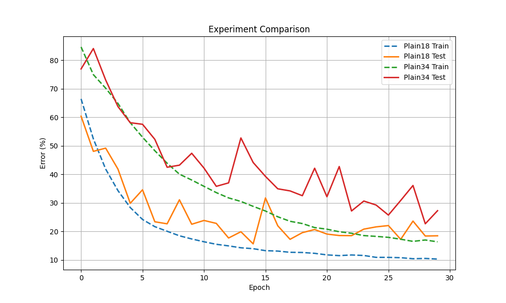

# 复现 ResNet 论文中的 degradation problem。
## 实验目标
1. 通过对比 Plain18 与 Plain34，验证普通卷积网络在层数加深后会出现训练误差反而升高的问题；
2. 再通过对比 ResNet18 与 ResNet34，验证残差连接能够缓解深层网络优化困难，使更深网络依然能够获得更好的训练效果与测试效果。
## 项目概述
1. resnet、plain训练代码（只是调utils实现的函数、具体训练代码实现在utlis中）分别在resnetTrain.py plainTrain.py
2. 数据集是CIFAR-10，位于data文件夹
3. 超参数统一设置在config.py
4. utils 文件夹存放绘制图像功能代码、以及详细训练代码（epoch具体的梯度下降实现）
5. models 文件夹是对应pilan resnet网络架构实现 和 resnet块实现
ResNet_rebuid/
├── data/                   # CIFAR-10 数据集（运行时自动下载）
├── models/                 # 网络结构定义
│   ├── resnet.py           # ResNet-18/34 实现
│   └── plainnet.py         # Plain-18/34 对照网络
├── utils/                  # 工具函数
│   ├── trainer.py          # 训练/验证逻辑
│   └── plot.py             # 可视化辅助
├── outputs/                # 训练日志与模型保存
├── config.py               # 超参数配置
├── resnetTrain.py          # ResNet 训练入口
├── plainTrain.py           # PlainNet 训练入口
├── train.ipynb             # 交互式训练 notebook
└── README.md               # 本文件
## 实验复现效果概览

图1：Plain-18 与 Plain-34 在 CIFAR-10 上的tain error 和 test error 

图2：ResNet-18 与Resnet-34 在 CIFAR-10 上的tain error 和 test error 
